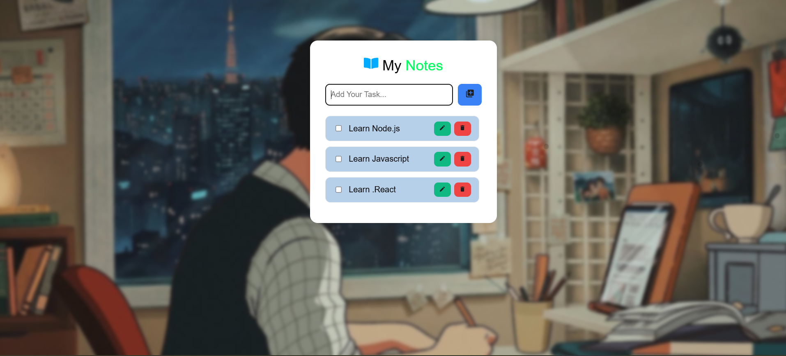

# 📝 React ToDo App (Vite)

A sleek and interactive To-Do application built using **React + Vite**, designed for smooth performance and a modern UI experience.

---

## ✨ Features

* ➕ Add new tasks
* ✏️ Edit tasks inline
* ✅ Mark tasks as completed
* ❌ Delete tasks
* 🌌 Animated background (Bubble effect UI)
* ⚡ Fast performance with Vite

---

## 📂 Project Structure

```
src/
│
├── App.jsx              # Main logic & state management
├── components/
│   ├── Header.jsx       # App title & heading
│   ├── TodoList.jsx     # Task list container
│   └── TodoItem.jsx     # Individual task item
│
└── assets/
    ├── bg-todo2.jpg      # Background image
    └── screenshot.png    # App preview image

---

## 🚀 Getting Started

### 1️⃣ Install Dependencies

```
npm install
```

### 2️⃣ Run Development Server

```
npm run dev
```

### 3️⃣ Open in Browser

```
http://localhost:5173/
```

---

## 🛠️ Tech Stack

* ⚛️ React
* ⚡ Vite
* 🎨 CSS3

---

## 📸 Preview



---

## 👨‍💻 Author

Developed with ❤️ by **Liku Pradhan**

🔗 GitHub:
https://github.com/liku9/ToDoApp-LikuPradhan

---
